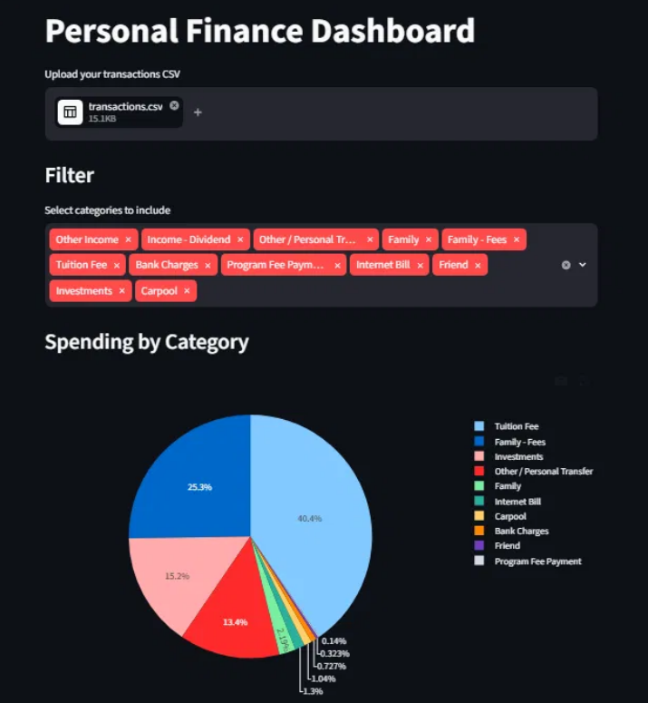
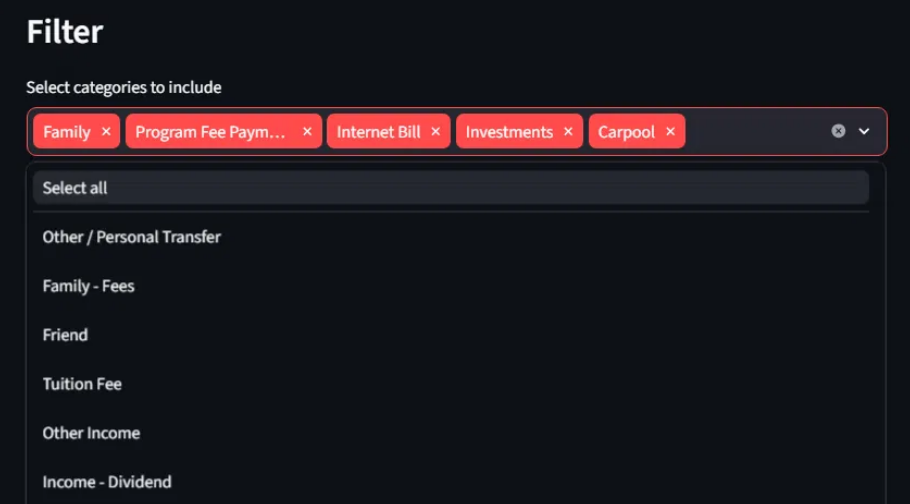
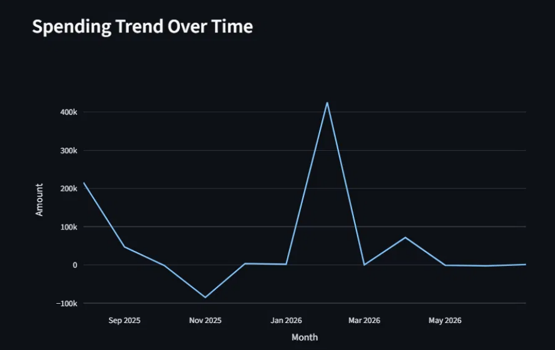
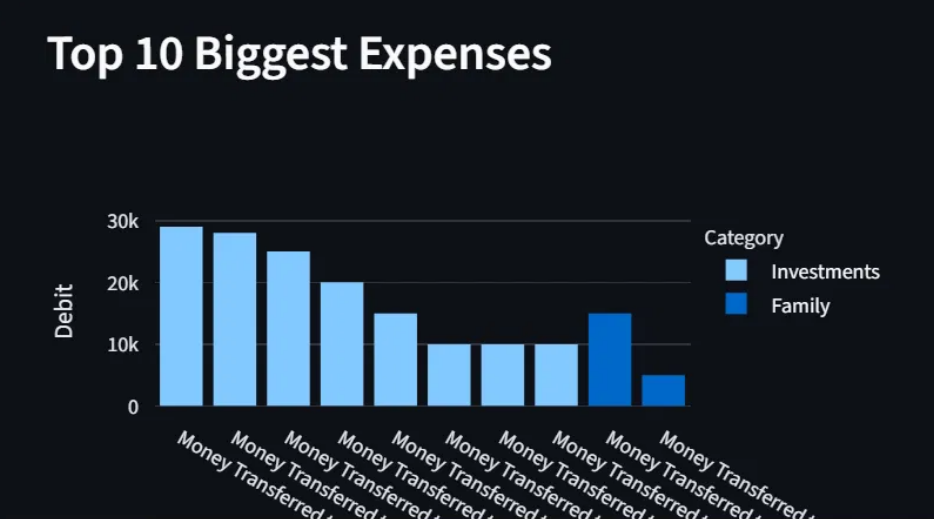

# Personal Finance Dashboard

A simple Streamlit app I built to visualize my bank transactions — upload a CSV, get a pie chart of spending by category, a monthly trend line, and a list of your biggest expenses.

This is one of my first small projects, mainly built to learn Streamlit + pandas + plotly.

## What it does

- Upload a bank statement CSV
- Automatically categorizes transactions (fees, tuition, family transfers, investments, etc.)
- Shows:
  - Spending by category (pie chart)
  - Spending trend over time (line chart)
  - Top 10 biggest expenses (bar chart)

## Screenshots

**Spending by Category**


**Category Filter**


**Spending Trend Over Time**


**Top 10 Biggest Expenses**


## How to run it

```bash
pip install -r requirements.txt
streamlit run app.py
```

Then open the link it gives you and upload your CSV.

## Note

The categorization rules live in `categories.json`, which is gitignored since mine has personal details in it (account numbers, names, etc.). A `categories.example.json` template is included instead — copy it to `categories.json` and fill in your own rules:

```bash
cp categories.example.json categories.json
```

